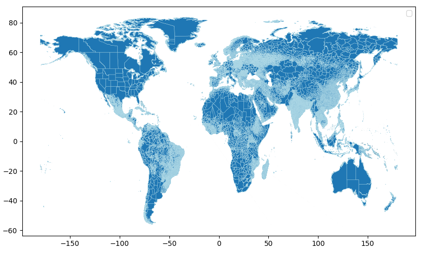

# Geoboundaries

This project downloads country shapefiles from [geoBoundaries](https://www.geoboundaries.org/), a project of the [William and Mary GeoLab](https://sites.google.com/view/wmgeolab/). The user may either specify countries to download shapefiles for, or else administrative levels to download.

## Usage

Use conda to install dependencies and create the environment:
```
conda env create -f environment.yaml
conda activate global_geoboundaries
```

Customize the behavior of the pipeline by modifying the configuration file `conf/config.yaml`. Here, use the commands ADM0–ADM5 to change the administrative level being downloaded, change the output filepath, and direct snakemake to do a dry run.

Next, run the following:
```
snakemake --cores 1
```

## Output
This workflow should yield a folder of shapefiles for all countries.

Below is a map of the global geoboundaries downloaded by this workflow and run with the `plot_shp.py` script in the scripts folder. Administrative level borders are light blue, so areas on the map that look solid light blue (e.g. India) simply have many small administrative areas.

